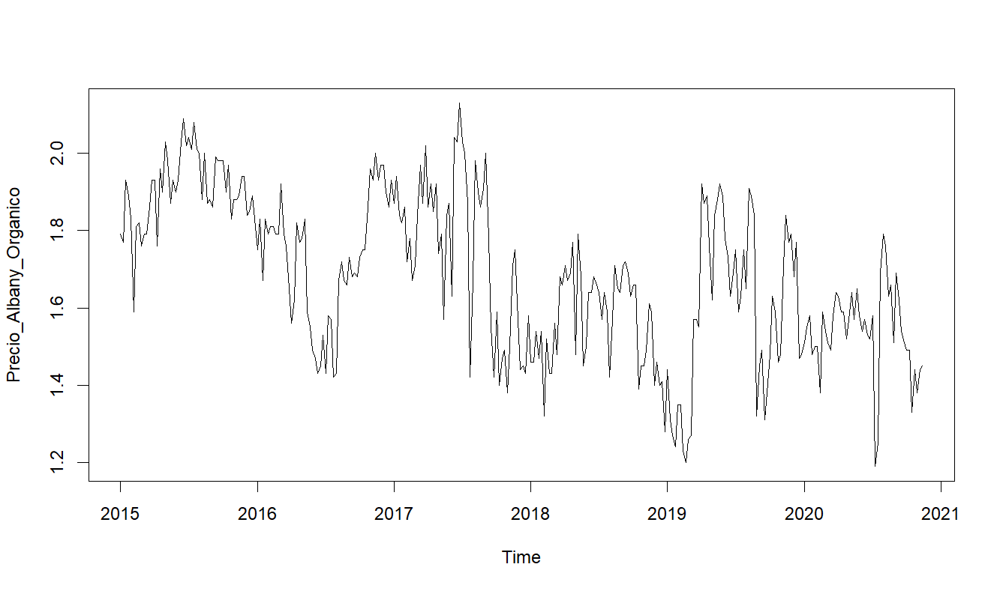

# 🥑 US Avocado Sales & Price Analysis (2015–2020)

This project presents a comprehensive data analysis of avocado sales and pricing trends across the United States between 2015-2020. Using Business Intelligence tools and R programming, I've extracted valuable commercial insights and developed predictive models.

---

## 📊 Executive Summary

- **Objective:** Explore market behaviour (organic vs conventional avocados), identify price/volume patterns, and build predictive models
- **Dataset:** Weekly US sales data from Kaggle ([Avocado Prices 2020](https://www.kaggle.com/timmate/avocado-prices-2020))
- **Scope:** 33,045 records (2015–2020)
- **Methodology:** Exploratory analysis, logarithmic regression modelling, and time series forecasting in RStudio

---

## 🛠 Technologies & Libraries

- **Core:** R/RStudio environment
- **Data Handling:** `readr`, `dplyr`, `tidyr`
- **Visualisation:** `ggplot2`, `plotly`
- **Modelling:** `stats::lm()`, `forecast`, ARIMA
- **Analysis:** `cor()`, `summary()`, `boxplot()`

---

## 🔍 Key Findings

- **Organic avocados show lower price elasticity:** 10% price increase → only 7.67% sales reduction
- **Conventional more price-sensitive:** Same increase → 13.2% sales decline
- **Albany region** displays **stable pricing trends**, suggesting inventory planning opportunities
- Significant **outliers identified** in both pricing and sales volume, particularly for organic products

---

## 📂 Repository Structure

```text
avocado-analysis/
│
├── data/
│   └── avocado-updated-2020.csv       # Updated dataset containing avocado price data
│
├── scripts/
│   └── avocado-analysis.R             # Main R script for data analysis
│
├── imgs/
│   ├── albany_organic_price_forecast_3months.png    # Forecast plot for organic avocado prices in Albany
│   ├── albany_organic_prices_decomposition.png      # Time series decomposition of organic prices
│   ├── average_price_boxplot.png                    # Boxplot showing average prices
│   ├── boxplot_precios.png                          # Boxplot visualizing price distribution
│   ├── price_by_type_boxplot.png                    # Boxplot comparing prices by type
│   ├── series_temporales.png                        # Time series plot of avocado prices
│   └── total_volume_boxplot.png                     # Boxplot of total avocado volume sold
│
└── README.md                          # Project documentation
```

---

## 🔮 Price Forecasting (ARIMA)

12-week price forecast for organic avocados in Albany indicates **market stability** despite typical volatility.



---

## 🎯 Business Insights

1. **Market volatility** necessitates continuous monitoring
2. **Organic products** sustain higher margins
3. **Time series analysis** provides actionable predictive value

---

## 🔗 Useful Links

- 📂 [Original Dataset (Kaggle)](https://www.kaggle.com/timmate/avocado-prices-2020)
- 💼 [My Professional Portfolio](https://agilpartida.com)

---

## 👨‍💻 Author

**Alejandro Gil Partida**  
Data Analyst

[](https://linkedin.com/in/agilpartida) 
[](https://github.com/agilpartida)

*This project demonstrates my approach to deriving commercial value from real-world data through rigorous statistical analysis.*
